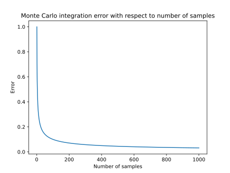

## Renderer
### Light Transport Equation

The core equation describing light transport in a rendered scene is
$$ L_o(P, \omega_o) = L_e(P, \omega_o) + \int_\Omega f(P,\omega_o,\omega_i) \cdot L_i(P, \omega_i) \cdot \cos \theta \cdot d \omega_i $$

Where

$$L_o(P, \omega_o) - \text{Outgoing light from point $P$ in direction $\omega_o$} $$

$$ L_e(P, \omega_o) - \text{Emitted light from point $P$ in direction $\omega_o$} $$

$$ f(P,\omega_o,\omega_i) - \text{Bidirectional Reflectance Distribution Function} $$
$$ \text{Ability of a surface to transport light at point $P$, to direction $\omega_o,$ where $\omega_i$ points towards the light source.} $$
$$ \text{Both $\omega_o$ and $\omega_i$ are outgoing from the point $P$. Hence the bidirectionality of this function.} $$

$$ L_i(P, \omega_i) - \text{Incoming light to the point $P$, where $\omega_i$ points towards the light source} $$

$$ \cos \theta - \text{Light weakening factor due to the angle between $\omega_i$ and a surface normal [$\omega_i \cdot n$]} $$

$$ \int_\Omega d\omega_i - \text{Integral of an hemisphere centered on point $P$} $$

### Recursion

Light outgoing from a point $P$ is a sum of light contributions from all points visible on the hemisphere. They in turn depend on the light from other hemisphere points, creating infinite recursion.

$$ L_o(P, \omega_o) = L_e(P, \omega_o) + \int_\Omega f(P,\omega_o,\omega_i) \cdot L_o(P', -\omega_i) \cdot \cos \theta \cdot d \omega_i $$

$$ L_o(P, \omega_o) = L_e(P, \omega_o) + \int_\Omega f(P,\omega_o,\omega_i)
\bigg(
    L_e(P', -\omega_i) + \int_{\Omega'} f(P',-\omega_i,\omega_j) \cdot L_o(P'', -\omega_j) \cdot \cos \theta' \cdot d \omega_j
\bigg)
\cdot \cos \theta \cdot d \omega_i $$

$$ L_o(P, \omega_o) = L_e(P, \omega_o) + \int_\Omega f(P,\omega_o,\omega_i)
\bigg(
    L_e(P', -\omega_i) + \int_{\Omega'} f(P',-\omega_i,\omega_j) \cdot 
        \bigg(
            L_e(P'', -\omega_j) + \int_{\Omega''} f(P'',-\omega_j,\omega_k)
            \cdot L_o(P''', -\omega_k)
            \cdot \cos \theta'' \cdot d \omega_k
        \bigg)
    \cdot \cos \theta' \cdot d \omega_j
\bigg)
\cdot \cos \theta \cdot d \omega_i $$

### Monte Carlo

The primary goal of the ray-traced renderer is therefore to recursively solve the Light Transport Equation in a reasonable amount of time.
To achieve this, Monte Carlo-based methods are used.

Expected value of a function $f(x)$ is defined as

$$ E(f(X)) = \int_{a}^{b} f(x)p(x) dx $$

where $p(x)$ is a probability density function of $x$.

Monte Carlo estimator is defined as:

$$ F = \frac{1}{n} \sum_{i=1}^{n} \frac{f(x_i)}{p(x_i)} $$

The interesting property of such estimator is that the expected value of it yields the integral of a function:

$$ E = \int_{a}^{b} \frac{1}{n} \sum_{i=1}^{n} \frac{f(x)}{p(x)}p(x) dx $$

$$ E = \int_{a}^{b} \frac{1}{n} \sum_{i=1}^{n} f(x) dx $$

$$ E = \int_{a}^{b} f(x) dx $$

Therefore, Monte Carlo estimator converges to the integral of $f(x)$.

Complex, multidimensional integrals can now be approximated by averaging sample points $x$, generated with given probability distribution.

$$ L_o = L_e + \int_\Omega f \cdot L_i \cdot \cos \theta \cdot d \omega_i $$

$$ L_o \approx L_e + \frac{1}{n} \sum \frac{f \cdot L_i \cdot \cos \theta}{p(\omega_i)} $$

where $p(\omega_i)$ is a probability density function value of randomly chosen $\omega_i$.

### Error estimation

The result calculated using this method is error-free only when infinite amount of samples were taken. To estimate an error resulting from using finite $n$ samples, Monte Carlo Estimator variance is calculated.

$$ Var(F) = E(F^2) - E^2(F) $$

With the property

$$ Var(aF) = a^2 Var(F) $$

Let random variable $X_i$ be a function $f(x)$ value in point $x_i$, generated with the distribution $p(x)$

$$ X_i = \frac{f(x_i)}{p(x_i)} $$

$$ F = \frac{1}{n} \sum_{i=1}^{n} X_i $$

Because the generated samples $X_i$ are independent of each other, variance of their average is the average of their variance.

$$ Var(F) = Var(\frac{1}{n} \sum_{i=1}^{n} X_i) =  \frac{1}{n^2} \sum_{i=1}^{n} Var(X_i) $$

Since each sample is generated from the same distribution, the estimator variance equation simplifies

$$ Var(X_1) = Var(X_2) = ... = Var(X_n) = Var(X) $$

$$ Var(F) = \frac{1}{n^2} \cdot nVar(X) $$

$$ Var(F) = \frac{1}{n} \cdot Var(X) $$

The variance of the sampling process $X$ depends on the integrated function $f(x)$ and used probability distribution $p(x)$. Those function will differ from case to case, depending on the particular equation solved during the rendering.
The constant term that does not change is the $\frac{1}{n}$.

$$ Var(F) \propto\frac{1}{n} $$

Since variance is the square of the standard deviation $\sigma$, the resulting error from Monte Carlo integration can be reduced by increasing the amount of samples $n$.

$$ \sigma = \sqrt{Var(F)} $$

$$ \sigma \propto \frac{1}{\sqrt{n}} $$

