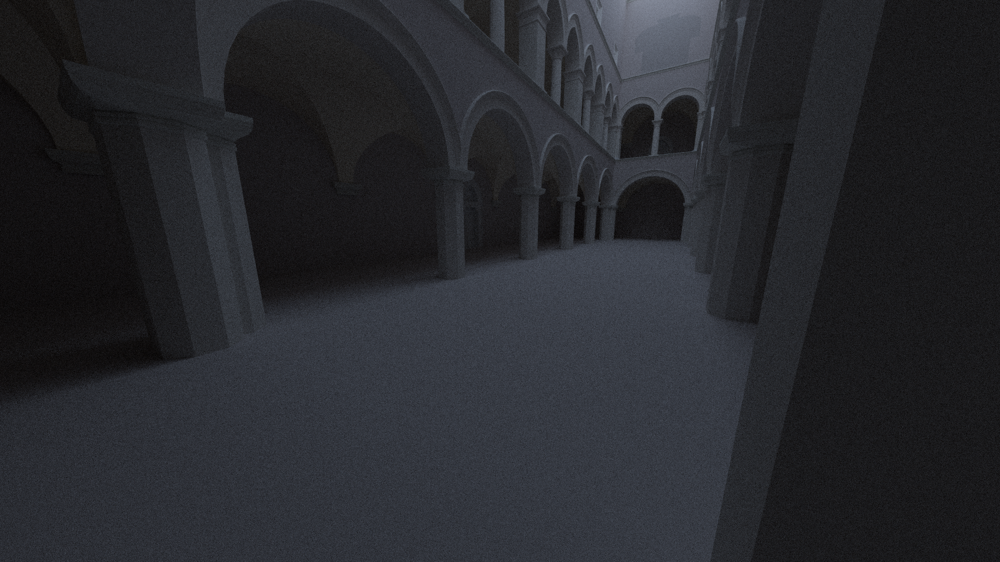

# Raytracer

## Examples
Breakfast room

```
Resolution: 1920x1080
Triangles in mesh: 269764
Traced rays: 2 810 738 937
Total execution time: 17 605 125ms = 4.89h
```

Sponza

```
Resolution: 1920x1080
Triangles in mesh: 66450
Traced rays: 4 236 279 842
Total execution time: 19 675 777ms = 5.47h

```
Cornell box spheres

```
Resolution: 1000x1000
Triangles in mesh: 2188
Traced rays: 2 389 898 379
Total execution time: 46 672 855ms = 12.96h
```

Cornell box

```
Resolution: 1000x1000
Triangles in mesh: 36
Traced rays: 110 020 216
Total execution time: 13 878ms = 14s
```

## Build & Run
The project is implemented in C++20, using:
* CMake > 3.15 - build system
* Docker - reproducible build environment
* Python 3 - Build and run orchestration scripts

To avoid manual dependency installation on the host system, the entire build process is encapsulated inside a Docker image.

### Building the application
To build the project, run:
```bash
./tools/build.py
```

The script will:
* automatically setup docker image with all of the necessary dependencies
* compile the code inside the container and export it to the *build* directory on host machine

You can also compile the project manually.
Having `build-essential` and your C++20 compiler of choice installed, run:
```bash
mkdir build
cd build
cmake ../src
make
cd ..
```

### Running the application
After a successful build, the application can be launched with:
```bash
./tools/run.py <config.json path>
```

or manually:
```bash
./build/raytracer config/suzanne-scene.json
```

## CLI
In addition to `.json` configuration files, it's also possible to render scene via `tools/raytracer-cli.py` tool

```
  -i        Path to .obj file
  -vp       Camera position [x y z]
  -vd       Camera direction [x y z]
  -up       Up direction [x y z]
  -fovy     Vertical field of view [degrees]
  -ltcol    Lights color [r g b]. Values in range <0.0, 1.0>
  -ltpos    Light position [x y z]
  -r        Recursion depth
  -res      Image resolution [x y]
  -o        Output file path
  -np       Paths per pixel
  -nl       Light samples per intersection

```

## Notes
1. [Monte Carlo](/docs/monte-carlo.md#renderer)

## Assumptions
### Units
All vertex defined in .obj file are assumed to use meters $[m]$ as space unit

Light emission parameter `Ke` defined in the `.mtl` files are assumed to be in Watts per squared meter $[\frac{W}{m^2}]$

## Sources
1. https://raytracing.github.io/books/RayTracingInOneWeekend.html
2. https://pbr-book.org/4ed/Monte_Carlo_Integration